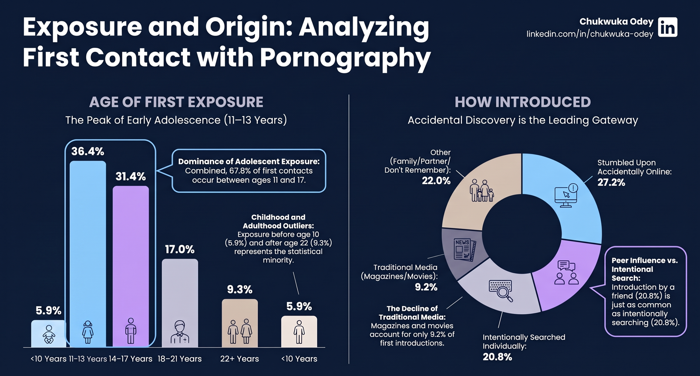
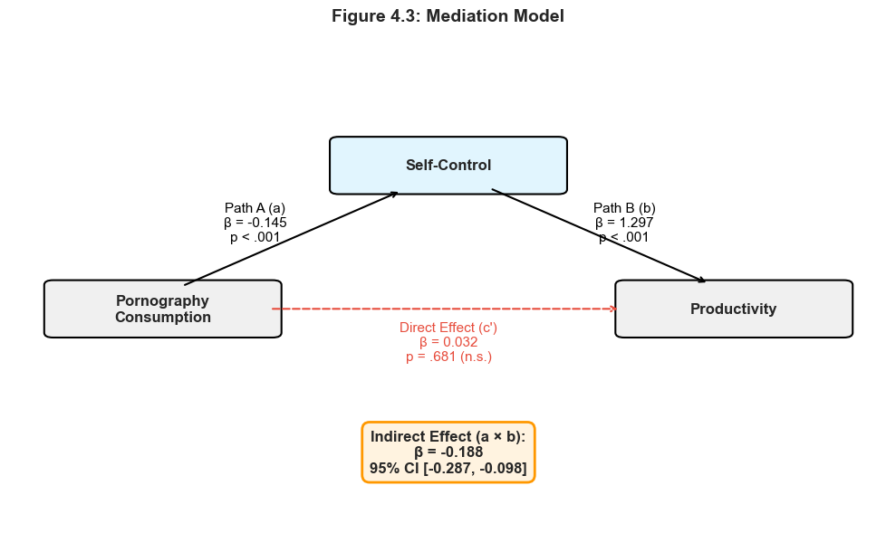

# Pornography, Self-Control & Productivity Among Young Adults

A mediation and developmental analysis of the relationship between pornography consumption, self-control, and daily productivity.

**Author:** Chukwuka Odey  
**LinkedIn:** linkedin.com/in/chukwuka-odey  
**Sample:** 250 young adults (18+)  
**Date:** September 2026

---

## Overview

---

## Mediation Model

---

## Key Finding

> Pornography use is linked to lower productivity - but only because it erodes self-control.

---

## Repository Contents

- data/ - Anonymised survey data (N = 250)
- notebooks/ - Python analysis code
- reports/ - Executive summary and journal manuscript
- dashboard/ - Power BI dashboard
- figures/ - Statistical figures

---

## Citation

Odey, C. (2026). GitHub.
